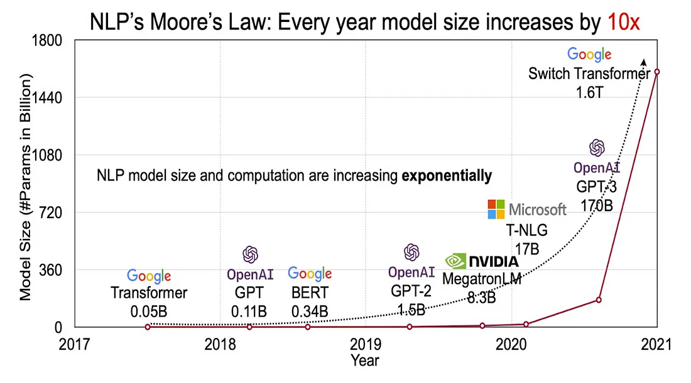

# Large Language Models as Stochastic Parrots

### Introduction

- The race to build bigger, faster, and more capable AI models is pushing organizations to stretch the limits of current technology.
- Significant resources and investments are being directed toward achieving breakthroughs in AI capabilities.
- As a result, we are seeing the rapid release of increasingly larger and more powerful models.

 

### Moore's Law for Large Language Models

- A variation of Moore's Law has emerged in the context of large language models, suggesting that the size of these models is increasing **10× every year**.

 

### Stochastic parrots

> A metaphor used to explain the idea that large language models, although capable of generating believable language, do not actually understand the meaning behind the language they process.

- Earlier language models were based on n-gram methods and could generate contextual content by analyzing multiple words together. This allowed them to consider contexts of over 2,000 words.
- As newer language models have been trained on more and more data, their ability to respond to a wide variety of user queries has improved. However, they still have not become more intelligent — they do not truly understand us better.

 

### Understanding Stochastic Parrots

> Large Language Models (LLMs) generate responses based on probabilities, not understanding.

- Suppose a user types: **"Water is made of __"**
- A language model (e.g., GPT-3.5) tries to complete the sentence by calculating the probability of each possible next word. For instance:
    - hydrogen => 45% probability  
    - Hydrogen => 30% probability  
    - H2O => 15% probability  
    - water => 5% probability  
    - oxygen => 5% probability  

- The word **"hydrogen"** has the highest probability, so it's selected.  
  The sentence becomes: **"Water is made of hydrogen __"**

- Next token predictions:
    - and => 80% probability  
    - , => 10% probability  
    - . => 8% probability  
    - oxygen => 2% probability  

- The model picks **"and"**, leading to: **"Water is made of hydrogen and __"**

- Next token predictions:
    - oxygen => 85% probability  
    - Oxygen => 10% probability  
    - nitrogen => 5% probability  

- The final sentence: **"Water is made of hydrogen and oxygen."**

---

> 🔍 **Key Insight:** The model doesn’t "know" that water is made of hydrogen and oxygen — it simply strings together the most probable words based on its training.

- Despite their impressive generation capabilities, **LLMs are driven purely by probabilistic predictions**, not actual comprehension.
- **Every input (prompt)** results in a completion based on **statistical likelihood of tokens**, not on reasoning or meaning.
- The model outputs what it has *seen before*, with some randomness, but:
  - ❌ It doesn’t understand the **question**
  - ❌ It doesn’t verify the **correctness** of the response
  - ❌ It doesn’t grasp **context** or **appropriateness**

> ⚠️ **This lack of true understanding can lead to misleading or harmful outputs, especially in critical applications.**
