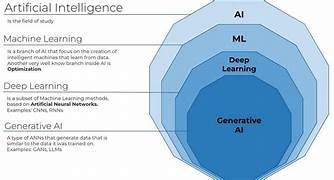

# 🤖 What is Generative Artificial Intelligence?

---

## 📚 Table of Contents
- [🧠 Artificial Intelligence](#-artificial-intelligence)
- [🎨 Generative Artificial Intelligence](#-generative-artificial-intelligence)
- [🧪 Types of Machine Learning Models](#-types-of-machine-learning-models)
- [🧬 Deep Learning](#-deep-learning)
- [🧩 Complete Picture](#-complete-picture)
- [💬 Generative Pre-trained Transformer (GPT)](#-generative-pre-trained-transformer-gpt)
- [✅ Benefits of Large Language Models](#-benefits-of-large-language-models)
- [🧾 Types of Generative AI Models](#-types-of-generative-ai-models)
- [🔄 Transformers for Text](#-transformers-for-text)
- [🖼️ Latent Diffusion for Images](#-latent-diffusion-for-images)
- [✍️ Prompt and Prompt Design](#-prompt-and-prompt-design)

---

## 🧠 Artificial Intelligence

**Artificial Intelligence (AI)** refers to simulating **human intelligence** in machines.  
A core branch of AI is **Machine Learning (ML)**, which uses **data and algorithms** to improve performance and decision-making over time.

---

## 🎨 Generative Artificial Intelligence

**Generative AI** is a type of AI that can **create new content** based on patterns it has learned from existing data.

- The learning process is called **training**.
- It results in a **stochastic (probabilistic) model**.
- Given a **prompt**, the model predicts likely outputs and generates content accordingly.

---

## 🧪 Types of Machine Learning Models

### 1. **Supervised Learning**
- Trained on **labeled data**.
- Example: Input: Image of a dog → Label: “Dog”

### 2. **Unsupervised Learning**
- Trained on **unlabeled data**.
- Learns to identify **hidden patterns** or **groupings** in the data.

---

## 🧬 Deep Learning

**Deep Learning** is inspired by the structure of the **human brain**, using **Artificial Neural Networks (ANNs)** with multiple layers.

### Types of Deep Learning Models:
- **Discriminative Models**: Learn to predict labels from input data (e.g., classification).
- **Generative Models**: Learn to **create new data** based on learned patterns (e.g., image generation, language modeling).

---

## 🧩 Complete Picture

> 

*Visual representation of the generative AI workflow.*

---

## 💬 Generative Pre-trained Transformer (GPT)

**Language Models** predict the **next word** in a sequence based on the context.

- **GPT-4** is a **multi-modal transformer model** trained on:
  - ~570 TB of data
  - 17.5 trillion parameters
- Can perform a wide variety of tasks **without fine-tuning**.

---

## ✅ Benefits of Large Language Models

- 📈 **Continuous Learning**: Models improve through new techniques and data.
- 🛠️ **Multi-domain Utility**: Helps with writing, coding, summarizing, etc.
- 🚀 **Efficiency Booster**: Speeds up research, development, and ideation.

---

## 🧾 Types of Generative AI Models

### 1. **Text-Based Models**
- Input: Text  
- Output: Text, Images, or Audio
- Use Cases: Chatbots, translation, summarization, text-to-speech

### 2. **Image-Based Models**
- Input: Image  
- Output: Modified or described image
- Use Cases: Image captioning, animation, enhancement

---

## 🔄 Transformers for Text

**Transformers** revolutionized NLP by solving **long-range dependency** issues that plagued earlier models (like RNNs).

- Efficiently process and understand **contextual relationships**
- Handle **sequence-to-sequence tasks** (e.g., translation, summarization)

---

## 🖼️ Latent Diffusion for Images

Based on **Autoencoder architecture**:

- **Encoder** compresses the image into a **latent space**
- **Decoder** reconstructs the image from latent data
- Latent Diffusion models:
  - Sample from this compressed space
  - Reconstruct detailed images from noisy, compressed representations
  - Use **text prompts** to guide generation

---

## ✍️ Prompt and Prompt Design

A **prompt** is the user-provided input that directs a generative model.

- Good **prompt design** ensures:
  - Clear instructions
  - Better and more accurate results
- Prompts vary in complexity:
  - Simple: "Write a poem"
  - Complex: "Generate a three-paragraph summary of climate change impacts using scientific tone"

---

> 🎯 *Generative AI represents a major leap in automation and creativity — but it depends heavily on how we teach it and how we use it.*
